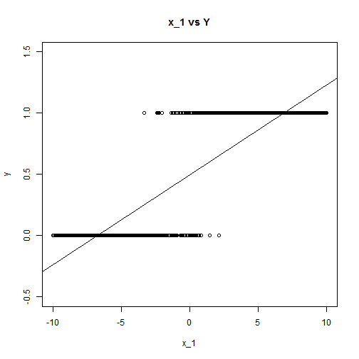

Categorical Data Analysis
========================================================
author: Hiroki Matsui
css: R_presentation.css
date: 2015/1/21  


はじめに
======================================================
- このプレゼンテーションは個人の見解で有り、いかなる所属組織の公式見解ではありません。
- 誤りの指摘を歓迎します。できれば、ソフトに表現してもらえるとモチベーションが下がりません。

自己紹介
======================================================
- Matsui Hiroki （ＲＰＴ，ＭＰＨ）
- 出身：滋賀県
- 専門：リハビリテーション、臨床疫学・医療経済学
- 元理学療法士→現在は大学教員  

- スキル：大規模観察データのハンドリング＆統計解析
- 興味：医療のOutcome Research


資料の確認
======================================================
- 今回お話する内容は以下のサイトにUPしてあります。
- スライド
  https://rpubs.com/Hiro_macchan/54220
- スライドハンドアウト
  https://rpubs.com/Hiro_macchan/54245
- 演習ドキュメント
  https://rpubs.com/Hiro_macchan/54617

また、演習用ドキュメントとデータとハンドアウトを圧縮したファイルが
必要な方はお申し出下さい。

本日お話する内容
=======================================================
- Categorical Outcome in Rheumatoid Arthritis (1min)
- Categorical Outcome の解析（単変量） (6min)
- Categorical Outcome の解析（多変量） (8min)
- 注意事項 (10min)
- 参考資料 (-min)

本日お話する内容
=======================================================
- Categorical Outcome in Rheumatoid Arthritis (1min) ←
- Categorical Outcome の解析（単変量） (6min)
- Categorical Outcome の解析（多変量） (8min)
- 注意事項 (10min)
- 参考資料 (-min)


Categorical Outcome
========================================================
- アウトカムとなる変数が二値以上の離散的な値であること
- Familiar with
 - Death (1 = death)
 - Readmission (1 = readmission)
- In Rheumatoid Arthritis
 - DAS remission (DAS28-ESR < 2.6)
 - HAQ remission (HAQ-DI <0.5)
 - Radiographic remission (delta TSS <U+2264>0)

本日お話する内容
=======================================================
- Categorical Outcome in Rheumatoid Arthritis (1min) 
- Categorical Outcome の解析（単変量） (6min) ←
- Categorical Outcome の解析（多変量） (8min) 
- 注意事項 (10min)
- 参考資料 (-min)


Categorical Outcome の解析（単変量）
========================================================
- **連続変数の場合**
 - 平均値を比較する。
 - $\mu = \frac{\sum_{k=1}^n(x_k)}{n}$, $var = \frac{\sum_{k=1}^n(x_k-\mu)^2}{n}$
 - t-testやANOVA 等でグループ間の平均を比較することが一般的

***

- **カテゴリカル変数の場合**
 - 割合(propotion)を比較する。
 - $p = \frac{X}{n}$, $var = p(1-p)$  
   *Xは事象1が起こった件数*
 - $\chi^2$ test 等でグループ間の割合の比較をするのが一般的
 - 発生までの速度（ハザード）を比べたりする手法もあるが今回は対象外。


Categorical Outcome の解析（単変量）
========================================================
**割合の比較**

    x   | col1   | col2
  ----|--------|--------
  row1| a     | b
  row2| c      | d
  - リスク  
    $Risk = \frac{a}{a+b}$
  - オッズ  
    $Odds = \frac{a/a+b}{b/a+b} = \frac{a}{b}$

***
 - リスク差
    $$
     \hat{RD} = \frac{a}{a+b} -\frac{c}{c+d} 
    $$
 - リスク比
    $$
    \hat{RR} = \frac{a}{a+b} / \frac{c}{c+d}
    $$
 - オッズ比
    $$
    \hat{OR} = \frac{a}{b} / \frac{c}{d}
    $$

Categorical Outcome の解析（単変量）
========================================================
**95%信頼区間**

x   | col1   | col2
  ----|--------|--------
  row1| a     | b
  row2| c      | d

  $P_a = \frac{a}{a+b}$,  $P_c = \frac{c}{c+d}$  

***

 - リスク差 (Rusk Difference)
    $$
     RD = \hat{RD} \pm 1.96SE
     $$
     $$
     SE = \sqrt{\frac{P_a(1-P_a)}{a+b}+\frac{P_c(1-P_c)}{c+d}}  
    $$

 - リスク比 (Risk Ratio)
    $$
    log(RR) = log(\hat{RR}) \pm 1.96SE
    $$
    $$
    SE=\sqrt{\frac{1}{a} - \frac{1}{a+b} + \frac{1}{c} - \frac{1}{c+d}}
    $$
 - オッズ比 (Odds Ratio)
    $$
    log(OR) = log(\hat{OR}) \pm 1.96SE
    $$$$
    SE=\sqrt{\frac{1}{a} + \frac{1}{b} + \frac{1}{c} + \frac{1}{d}}
    $$


Categorical Outcome の解析（単変量）
========================================================
class: small-code
- $\chi^2$ test with R

    x | **col1**   | **col2**
  ----|:--------:|--------:
  **row1**| 14     | 8
  **row2**| 4      | 17
 - chisq.test(x)


```r
x <- matrix(c(14, 8, 4, 17), ncol=2, byrow=T)
chisq.test(x)
```

```

	Pearson's Chi-squared test with Yates' continuity correction

data:  x
X-squared = 7.0406, df = 1, p-value = 0.007968
```
***
- Fisher's exact test
  - fisher.test(x)

```r
 fisher.test(x)
```

```

	Fisher's Exact Test for Count Data

data:  x
p-value = 0.005089
alternative hypothesis: true odds ratio is not equal to 1
95 percent confidence interval:
  1.56789 39.54979
sample estimates:
odds ratio 
  7.051895 
```

Categorical Outcome の解析（単変量）
========================================================
**オッズ比の解釈**  
- 基準値1 (*0<OR<inf*)
- 臨床的解釈
 - Number Needed to Treat(NNT)
 
 $NNT = \frac{1}{RD} = \frac{1}{EER - UER}$
 
 $= \frac{1}{(OR-1)\times UER} + \frac{OR}{(OR-1)\times(1-UER)}$  
  $EER:Exposed Event Propotion, UER:Unexposed Event Propotion$  
- 一人アウトカムが増えるには何人治療（曝露）を受けなければならないか。
  Number needed to be exposed(NNE) とか呼び方は色々あるのでシチュエーションに合わせて使いわけ。
  
本日お話する内容
=======================================================
- Categorical Outcome in Rheumatoid Arthritis (1min) 
- Categorical Outcome の解析（単変量） (6min) 
- Categorical Outcome の解析（多変量） (8min) ←
- 注意事項 (10min)
- 参考資料 (-min)


普通の多変量回帰が困難な理由
==================================
class: small-code
**多変量回帰（一般線形モデル）**
$$
Y = \beta_0 + \beta_1x_1 + \eta  
$$
$$
Y = \{y|0,1\}
$$


```r
summary(lm(y~x_1))
```

```

Call:
lm(formula = y ~ x_1)

Residuals:
     Min       1Q   Median       3Q      Max 
-0.66515 -0.16858  0.00494  0.17059  0.64187 

Coefficients:
            Estimate Std. Error t value Pr(>|t|)    
(Intercept) 0.504970   0.007954   63.48   <2e-16 ***
x_1         0.073580   0.001353   54.39   <2e-16 ***
---
Signif. codes:  0 '***' 0.001 '**' 0.01 '*' 0.05 '.' 0.1 ' ' 1

Residual standard error: 0.2513 on 998 degrees of freedom
Multiple R-squared:  0.7477,	Adjusted R-squared:  0.7475 
F-statistic:  2958 on 1 and 998 DF,  p-value: < 2.2e-16
```

普通の多変量回帰が困難な理由
==================================
class: small-code

 
- Y の値は$\{0,1\}$ であるはずなのにあり得ない数値が存在する。

***

 
- 残差が全く均等に分布しない。

logistic regression
==================================
- ロジスティック回帰とは*Y* を予測するのではなく、*リスク(propotion)* を予測するモデル。
 

logistic regression
==================================
- ロジスティック回帰とは*Y* を予測するのではなく、*リスク(propotion)* を予測するモデル。
 - リスクPをうまく表現できる関数
 - $P=f(z)=\frac{1}{1+e^{-z}}$
 - $f(z)$ を*Logistic Function* と呼んでいる。

***
- グラフを書いてみると先ほどのリスクのグラフとよく似ているのがわかる。
 

logistic regression
==================================
**Logistic Function からLogistic regression へ**
- $P=f(z)=\frac{1}{1+e^{-z}}$ は$z$ という変数で決まっている。
- たとえば年齢が高いとリスクが高いという状況は、「$z$はAGEが高いほど大きくなる」とあらわせる。  
  $z = \beta_0+\beta_1x_1 + \beta_2x_2 + \cdots+\beta_kx_k$  
  $f(z) = \frac{1}{1+e^{-z}}$  
  $f(z) = \frac{1}{1+e^{-\beta_0+\beta_1x_1 + \beta_2x_2 + \cdots+\beta_kx_k}}$
- あらわされる関数($f(z)$)が実際のデータから算出されるPをうまくあらわすように$\beta_0 \cdots \beta_kx_k$ を設定してあげる。
- 設定の仕方（最尤推定）はソフトウェアに任せる。
- 一般線形モデルを一般化した線形モデルなので**一般化線形モデル**などと呼ばれる

logistic regression
==================================
**Logistic regression とOdds Ratio**
- $P=f(z)=\frac{1}{1+e^{-z}}$をzについて解く
$z = log(\frac{p}{1-p})$
- $\frac{p}{1-p}$ はOddsをあらわす。

logistic regression
==================================
- つまり、男性のz を$z_m$ 女性のz を$z_f$とすると、$z = \beta_0+\beta_1Sex + \beta_2Age$ の$\beta_1$が示すものは$log(OR)$となる。  
$\beta_1 = \frac{z_m-z_f}{1-0}$  
$=log(\frac{p_m}{1-p_m})-log(\frac{p_f}{1-p_f})$  
$= log(\frac{p_m}{1-p_m}/\frac{p_f}{1-p_f})$  
$OR = \frac{p_m}{1-p_m}/\frac{p_f}{1-p_f}= e^{\beta_1}$

年齢（連続変数）の場合年齢が1単位増加した場合のオッズ比を算出できる。  
$\beta$の信頼区間の出し方などはソフトウェアに任せましょう。

logistic regression の使いどころ
===========================================
Logistic regression には大きく2つの使いどころがある。
- 因果推論モデル
- 予測モデル

この二つは、似ているようで注意すべき点が異なる。  
そのため自分がどちらの使い方をしているのか意識しておく必要がある。


logistic regression の使いどころ
===========================================
**因果推論モデル**  

- 独立変数対する従属変数の影響度合を知りたい。  
- 見たいパラメータ: $\beta$  

*例えば*  

 - リウマチ症例において、特定の因子（治療や患者背景）が症状の寛解と関連しているか調べたい。


***
**予測モデル**
- 従属変数を所与として、それぞれの症例のアウトカムが生じる確率を知りたい。
- 見たいパラメータ: $P$  

*例えば*  

 - リウマチ症例において、症状が寛解するかどうかを各種予後因子から予測したい。

logistic regression の実施
===========================================
class: small-code
- R ではglm()を用いることが多い。
 - glm(): 一般化線形モデルの実行
 - glm(data, formula, family = logit(binomial))


```
processing file: R_presentation.Rpres
Quitting from lines 348-350 (R_presentation.Rpres) 
 以下にエラー file(file, "rt") :  コネクションを開くことができません
```
