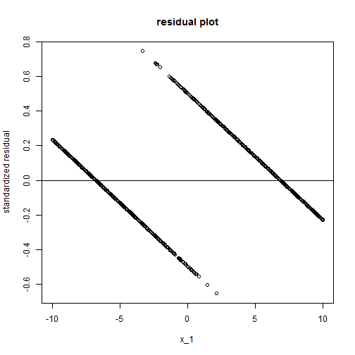
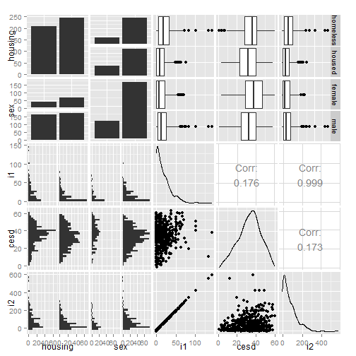

Categorical Data Analysis
========================================================
author: Hiroki Matsui
css: R_presentation.css
date: 2015/1/21  


はじめに
======================================================
- このプレゼンテーションは個人の見解で有り、いかなる所属組織の公式見解ではありません。
- 誤りの指摘を歓迎します。できれば、ソフトに表現してもらえるとモチベーションが下がりません。

自己紹介
======================================================
- Matsui Hiroki （ＲＰＴ，ＭＰＨ）
- 出身：琵琶湖
- 専門：リハビリテーション、臨床疫学・医療経済学
- 元理学療法士→現在は大学教員  

- スキル：大規模観察データのハンドリング＆統計解析
- 興味：医療のOutcome Research


本日お話する内容
=======================================================
- Categorical Outcome in Rheumatoid Arthritis (1min)
- Categorical Outcome の解析（単変量） (6min)
- Categorical Outcome の解析（多変量） (8min)
- 注意事項 (10min)
- 参考資料 (-min)

本日お話する内容
=======================================================
- Categorical Outcome in Rheumatoid Arthritis (1min) ←
- Categorical Outcome の解析（単変量） (6min)
- Categorical Outcome の解析（多変量） (8min)
- 注意事項 (10min)
- 参考資料 (-min)


Categorical Outcome
========================================================
- アウトカムとなる変数が二値以上の離散的な値であること
- Familiar with
 - Death (1 = death)
 - Readmission (1 = readmission)
- In Rheumatoid Arthritis
 - DAS remission (DAS28-ESR < 2.6)
 - HAQ remission (HAQ-DI <0.5)
 - Radiographic remission (delta TSS ≤0)

本日お話する内容
=======================================================
- Categorical Outcome in Rheumatoid Arthritis (1min) 
- Categorical Outcome の解析（単変量） (6min) ←
- Categorical Outcome の解析（多変量） (8min) 
- 注意事項 (10min)
- 参考資料 (-min)


Categorical Outcome の解析（単変量）
========================================================
- **連続変数の場合**
 - 平均値を比較する。
 - $\mu = \frac{\sum_{k=1}^n(x_k)}{n}$, $var = \frac{\sum_{k=1}^n(x_k-\mu)^2}{n}$
 - t-testやANOVA 等でグループ間の平均を比較することが一般的

***

- **カテゴリカル変数の場合**
 - 割合(propotion)を比較する。
 - $P = \frac{X}{n}$, $var = p(1-p)$  
   *Xは事象1が起こった件数*
 - $\chi^2$ test 等でグループ間の割合の比較をするのが一般的
 - 発生までの速度（ハザード）を比べたりする手法もあるが今回は対象外。


Categorical Outcome の解析（単変量）
========================================================
**割合の比較**

    x   | col1   | col2
  ----|--------|--------
  row1| a     | b
  row2| c      | d
  - リスク  
    $Risk = \frac{a}{a+b}$
  - オッズ  
    $Odds = \frac{a/a+b}{b/a+b} = \frac{a}{b}$

***
 - リスク差
    $$
     \hat{RD} = \frac{c}{c+d} 
    $$
 - リスク比
    $$
    \hat{RR} = \frac{a}{a+b} / \frac{c}{c+d}
    $$
 - オッズ比
    $$
    \hat{OR} = \frac{a}{b} / \frac{c}{d}
    $$

Categorical Outcome の解析（単変量）
========================================================
**95%信頼区間**

x   | col1   | col2
  ----|--------|--------
  row1| a     | b
  row2| c      | d

  $P_a = \frac{a}{a+b}$,  $P_c = \frac{c}{c+d}$  

***

 - リスク差 (Rusk Difference)
    $$
     RD = \hat{RD} \pm 1.96SE
     $$
     $$
     SE = \sqrt{\frac{P_a(1-P_a)}{a+b}+\frac{P_c(1-P_c)}{c+d}}  
    $$

 - リスク比 (Risk Ratio)
    $$
    log(RR) = log(\hat{RR}) \pm 1.96SE
    $$
    $$
    SE=\sqrt{\frac{1}{a} - \frac{1}{a+b} + \frac{1}{c} - \frac{1}{c+d}}
    $$
 - オッズ比 (Odds Ratio)
    $$
    log(OR) = log(\hat{OR}) \pm 1.96SE
    $$$$
    SE=\sqrt{\frac{1}{a} + \frac{1}{b} + \frac{1}{c} + \frac{1}{d}}
    $$


Categorical Outcome の解析（単変量）
========================================================
class: small-code
- $\chi^2$ test with R

    x | **col1**   | **col2**
  ----|:--------:|--------:
  **row1**| 14     | 8
  **row2**| 4      | 17
 - chisq.test(x)


```r
x <- matrix(c(14, 8, 4, 17), ncol=2, byrow=T)
chisq.test(x)
```

```

	Pearson's Chi-squared test with Yates' continuity correction

data:  x
X-squared = 7.0406, df = 1, p-value = 0.007968
```
***
- Fisher's exact test
  - fisher.test(x)

```r
 fisher.test(x)
```

```

	Fisher's Exact Test for Count Data

data:  x
p-value = 0.005089
alternative hypothesis: true odds ratio is not equal to 1
95 percent confidence interval:
  1.56789 39.54979
sample estimates:
odds ratio 
  7.051895 
```

Categorical Outcome の解析（単変量）
========================================================
**オッズ比の解釈**  
- 基準値1 (*0<OR<inf*)
- 臨床的解釈
 - Number Needed to Treat(NNT)
 
 $NNT = \frac{1}{RD} = \frac{1}{EER - UER}$
 
 $= \frac{1}{(OR-1)\times UER} + \frac{OR}{(OR-1)\times(1-UER)}$  
  $EER:Exposed Event Propotion, UER:Unexposed Event Propotion$  
- 一人アウトカムが増えるには何人治療（曝露）を受けなければならないか。
  Number needed to be exposed(NNE) とか呼び方は色々あるのでシチュエーションに合わせて使いわけ。
  
本日お話する内容
=======================================================
- Categorical Outcome in Rheumatoid Arthritis (1min) 
- Categorical Outcome の解析（単変量） (6min) 
- Categorical Outcome の解析（多変量） (8min) ←
- 注意事項 (10min)
- 参考資料 (-min)


普通の多変量回帰が困難な理由
==================================
class: small-code
**多変量回帰（一般線形モデル）**
$$
Y = \beta_0 + \beta_1x_1 + \eta  
$$
$$
Y = \{y|0,1\}
$$


```r
summary(lm(y~x_1))
```

```

Call:
lm(formula = y ~ x_1)

Residuals:
     Min       1Q   Median       3Q      Max 
-0.65292 -0.18391  0.00459  0.18782  0.64625 

Coefficients:
            Estimate Std. Error t value Pr(>|t|)    
(Intercept) 0.508401   0.008272   61.46   <2e-16 ***
x_1         0.074137   0.001438   51.56   <2e-16 ***
---
Signif. codes:  0 '***' 0.001 '**' 0.01 '*' 0.05 '.' 0.1 ' ' 1

Residual standard error: 0.2615 on 998 degrees of freedom
Multiple R-squared:  0.7271,	Adjusted R-squared:  0.7268 
F-statistic:  2659 on 1 and 998 DF,  p-value: < 2.2e-16
```

普通の多変量回帰が困難な理由
==================================
class: small-code

 
- Y の値は$\{0,1\}$ であるはずなのにあり得ない数値が存在する。

***

 
- 残差が全く均等に分布しない。

logistic regression
==================================
- ロジスティック回帰とは*Y* を予測するのではなく、*リスク(propotion)* を予測するモデル。
 

logistic regression
==================================
- ロジスティック回帰とは*Y* を予測するのではなく、*リスク(propotion)* を予測するモデル。
 - リスクPをうまく表現できる関数
 - $P=f(z)=\frac{1}{1+e^{-z}}$
 - $f(z)$ を*Logistic Function* と呼んでいる。

***
- グラフを書いてみると先ほどのリスクのグラフとよく似ているのがわかる。
 

logistic regression
==================================
**Logistic Function からLogistic regression へ**
- $P=f(z)=\frac{1}{1+e^{-z}}$ は$z$ という変数で決まっている。
- たとえば年齢が高いとリスクが高いという状況は、「$z$はAGEが高いほど大きくなる」とあらわせる。  
  $z = \beta_0+\beta_1x_1 + \beta_2x_2 + \cdots+\beta_kx_k$  
  $f(z) = \frac{1}{1+e^{-z}}$  
  $f(z) = \frac{1}{1+e^{-\beta_0+\beta_1x_1 + \beta_2x_2 + \cdots+\beta_kx_k}}$
- あらわされる関数($f(z)$)が実際のデータから算出されるPをうまくあらわすように$\beta_0 \cdots \beta_kx_k$ を設定してあげる。
- 設定の仕方（最尤推定）はソフトウェアに任せる。
- 一般線形モデルを一般化した線形モデルなので**一般化線形モデル**などと呼ばれる

logistic regression
==================================
**Logistic regression とOdds Ratio**
- $P=f(z)=\frac{1}{1+e^{-z}}$をzについて解く
$z = log(\frac{p}{1-p})$
- $\frac{p}{1-p}$ はOddsをあらわす。

logistic regression
==================================
- つまり、男性のz を$z_m$ 女性のz を$z_f$とすると、$z = \beta_0+\beta_1Sex + \beta_2Age$ の$\beta_1$が示すものは$log(OR)$となる。  
$\beta_1 = \frac{z_m-z_f}{1-0}$  
$=log(\frac{p_m}{1-p_m})-log(\frac{p_f}{1-p_f})$  
$= log(\frac{p_m}{1-p_m}/\frac{p_f}{1-p_f})$  
$OR = \frac{p_m}{1-p_m}/\frac{p_f}{1-p_f}= e^{\beta_1}$

年齢（連続変数）の場合年齢が1単位増加した場合のオッズ比を算出できる。  
$\beta$の信頼区間の出し方などはソフトウェアに任せましょう。

logistic regression の使いどころ
===========================================
Logistic regression には大きく2つの使いどころがある。
- 因果推論モデル
- 予測モデル

この二つは、似ているようで注意すべき点が異なる。  
そのため自分がどちらの使い方をしているのか意識しておく必要がある。


logistic regression の使いどころ
===========================================
**因果推論モデル**  

- 独立変数対する従属変数の影響度合を知りたい。  
- 見たいパラメータ: $\beta$  

*例えば*  

 - リウマチ症例において、特定の因子（治療や患者背景）が症状の寛解と関連しているか調べたい。


***
**予測モデル**
- 従属変数を所与として、それぞれの症例のアウトカムが生じる確率を知りたい。
- 見たいパラメータ: $P$  

*例えば*  

 - リウマチ症例において、症状が寛解するかどうかを各種予後因子から予測したい。

logistic regression の実施
===========================================
class: small-code
- R ではglm()を用いることが多い。
 - glm(): 一般化線形モデルの実行
 - glm(data, formula, family = logit(binomial))


```r
train_data <- read.csv("http://www.ats.ucla.edu/stat/data/binary.csv")
summary(train_data)
```

```
     admit             gre             gpa             rank      
 Min.   :0.0000   Min.   :220.0   Min.   :2.260   Min.   :1.000  
 1st Qu.:0.0000   1st Qu.:520.0   1st Qu.:3.130   1st Qu.:2.000  
 Median :0.0000   Median :580.0   Median :3.395   Median :2.000  
 Mean   :0.3175   Mean   :587.7   Mean   :3.390   Mean   :2.485  
 3rd Qu.:1.0000   3rd Qu.:660.0   3rd Qu.:3.670   3rd Qu.:3.000  
 Max.   :1.0000   Max.   :800.0   Max.   :4.000   Max.   :4.000  
```


logistic regression の実施
===========================================
class: small-code
- R ではglm()を用いることが多い。
 - glm(): 一般化線形モデルの実行
 - glm(data, formula, family = logit(binomial))


```

Call:
glm(formula = admit ~ gre + gpa + rank, family = "binomial", 
    data = train_data)

Deviance Residuals: 
    Min       1Q   Median       3Q      Max  
-1.6268  -0.8662  -0.6388   1.1490   2.0790  

Coefficients:
             Estimate Std. Error z value Pr(>|z|)    
(Intercept) -3.989979   1.139951  -3.500 0.000465 ***
gre          0.002264   0.001094   2.070 0.038465 *  
gpa          0.804038   0.331819   2.423 0.015388 *  
rank2       -0.675443   0.316490  -2.134 0.032829 *  
rank3       -1.340204   0.345306  -3.881 0.000104 ***
rank4       -1.551464   0.417832  -3.713 0.000205 ***
---
Signif. codes:  0 '***' 0.001 '**' 0.01 '*' 0.05 '.' 0.1 ' ' 1

(Dispersion parameter for binomial family taken to be 1)

    Null deviance: 499.98  on 399  degrees of freedom
Residual deviance: 458.52  on 394  degrees of freedom
AIC: 470.52

Number of Fisher Scoring iterations: 4
```

本日お話する内容
=======================================================
- Categorical Outcome in Rheumatoid Arthritis (1min) 
- Categorical Outcome の解析（単変量） (6min) 
- Categorical Outcome の解析（多変量） (8min) 
- 注意事項 (10min) ←
- 参考資料 (-min)


logistic regression の実施に伴う諸注意
===========================================
Logistic Regression はコマンド一つで簡単に実施できる。
しかし、注意しておくべき点がいくつかある。
 - Sufficient events per independent variable(イベント頻度と変数)
 - Conformity with linear gradient for continuous variables(共変量の線型性)
 - Tests for interactions(交互作用項)
 - Collinearity(多重共線性)
 - Goodness-of-fit, Discrimination measures(適合度)
 - Validation(妥当性の検証)
 - Statistical significance(統計学的有意性)

Sufficient events per independent variable
===========================================
イベント数が極めて少ない場合等で、$\beta$の推計値が極めて不安定になる。

Sex=1|Treat=0|Treat=1|Treat=2
-----|-------|--------|--------
death=0|123  |246| 150
death=1|5 |0|10

*対応*
- まずは、クロス表で確認しそのうえでモデルを組む。
- 変数の統合（Factor=0とFactor=1を統合）
- Propensity Score による解析に切り替える。


Conformity with linear gradient for continuous variables(共変量の線型性)
=============================================
独立変数が連続変数の場合、従属変数との関係は線形であることを仮定している。
 
  
例えば、上記の場合推計した$\beta$はOutcome に対する因子の効果を正しく推計していない。  
**確認**
- まずは、関係性をグラフを書いてチェック
- 共変量をカテゴリー化してモデルに投入
  オッズ比は線形になっているか？

Conformity with linear gradient for continuous variables(共変量の線型性)
=============================================
*対応*
- 共変量をカテゴリー化してモデルに投入しOdds比を報告
- スプライン関数や多項式回帰を用いて変数を変換する。


Tests for interactions(交互作用項)
===========================================
交互作用：変数の組み合わせでOutcome との関連が異なる変数があるかどうか。  
**例えば**  
 - 治療薬Aは特定の遺伝子マーカーを有する腫瘍には効果があるが、そうでない腫瘍には効果がない。
 - 結婚は男性にとっては余命を延ばす効果があるが、女性にとっては余命を短縮する効果がある。
 
交互作用項は二つの変数の積であらわされる。
 $$logit(p) = \beta_0 + \beta_1 x_1 + \beta_2 x_2 +\beta_3 x_1*x_2$$
 
 
 
Tests for interactions(交互作用項)
===========================================
交互作用の解釈
 $$logit(p) = \beta_0 + \beta_1 x_1 + \beta_2 x_2 +\beta_3 x_1*x_2$$
- $x_1$と$x_2$の交互作用が合った場合、$x_1$のOdds ratio は$x_2$が1の場合 exp($\beta_1+\beta_3$)になる。
- 予測値を計算して報告すると見やすい。

Collinearity(多重共線性)
===========================================
変数間の相関があまりに強いと$\beta$ の推計値が安定しなくなる。予測値にはあまり影響しない。  

**確認**
- 変数間の相関を確認し強い相関がないか？
- サンプルを一部除き再度回帰を行った際、大きく係数が変わらないか？  

***

 

Collinearity(多重共線性)
===========================================
- VIF を計算しすべての変数が10を下回っているか？


**対応**
- 相関の強い変数の一方を削除する。
- 変数を合成する。
- 症例数が多いとあまり問題にならなくなる。

Goodness-of-fit, Discrimination measures(適合度)
===========================================
モデルがそのデータをどの程度うまく表しているか？
- ROC 曲線を描き、AUC(c-statistics) を求める。
- Hosmar-Lameshow test
等。AUC を求めるのが一般的。

Validation(妥当性の検証)
===========================================
***因果推論モデル***  
- $\beta$ がおかしな方向に行っていないか。
- 重要な従属変数が抜け落ちていないか。
- 基本的には既存研究などと比較し妥当性を判断する。

***過剰適合***  
- サンプル数に対して独立変数が多すぎる場合に生じる。  
 - 100人のサンプルに対して99個の独立変数を投入すると予測は出来るが汎用性がなくなるイメージ。
 - 共変量の数はイベントに対して適当か？
 
Validation(妥当性の検証)
===========================================
***予測モデル***作成時はさらに以下を確認する。  
モデルの*内的妥当性*および、*外的妥当性*を検証する。
**内的妥当性**
今回作成したモデルが過剰にデータにフィットしていないか確認する。
- サンプル分割
- クロスバリデーション
- bootstrapping
等による予測精度の確認。
**外的妥当性**
今回作成したモデルが**他のデータ**にフィットしているか確認する。
- 他施設新データをとってくる。
- 他国のデータに当てはめる。
適合度を確認する。


Statistical significance(統計学的有意性)
=====================================
- モデル全体の有意性($H_0:すべての\beta=0$)
- 各係数の有意性


logistic regression の報告に伴う諸注意
===========================================
さらに、報告する際には以下を明記する。
 - Selection of independent variables(変数選択)
 - Coding of variables(主としてReferenceの設定)
 - Fitting procedure(モデル構築)

Selection of independent variables(変数選択)
===============================================
今まで存在する知見などから、全ての共変量を網羅する。
- 取得できなかった共変量はUnmeasured Confounder もしくは
予測精度低下の原因となる。 →Limitation


Coding of variables(主としてReferenceの設定)
===========================================
Odds Ratio はReferenceとの関連で表される。
- カテゴリー変数はどこをReferenceにしたか明記。
- 連続変数は平均を基準に1単位増加した際のOdds Ratio をあらわしている。


Fitting procedure(モデル構築)
===========================================
- どの変数を、どのように投入するかがモデル構築において極めて重要
 - 強制投入法  
  モデルがすでにある程度所与の場合に利用。必要となる変数を一度にすべて投入し結果を報告する。

 - 逐次投入法  
  考えうる変数群を用意し、順に投入する。投入過程で複数のモデルができるのですべて報告する。モデル間の係数の変化などから考察を深める。
 - 変数選択法  
   変数群から自動的に変数を選択する。選択されたモデルが真のモデルであることの保証はない。因果推論モデルでは利用することはほぼない。


本日お話する内容
=======================================================
- Categorical Outcome in Rheumatoid Arthritis (1min) 
- Categorical Outcome の解析（単変量） (6min) 
- Categorical Outcome の解析（多変量） (8min) 
- 注意事項 (10min)
- 追加資料 (10min) ← 余裕があれば。
- 参考資料 (-min)


【追加内容】クラスターデータでの解析
===========================================
個々の測定がクラスター単位で似通ってくる。
- 同一患者を複数回測定した場合、同一患者は似通っている。
- 多施設共同研究の場合、同一施設は似通っている
- Case-Control Study 等の場合、ペアは似通ってくる。
- このデータをすべて独立のサンプルから得たデータとして解析すると分散の過小評価が生じる（不当に有意な結果が出やすくなる）。

**対応**
- マルチレベル分析（mixed-effect model）
- Generarized Estimation Eqasions(GEE)
- Conditional Logistic model を使う。


【追加内容】オッズ比を報告する場合のOmitted variable
===========================================
<a href="http://dagitty.net/dags.html?id=g7mzV">リンク先のDAGに</a>おいて調整すべき因子は何か？
- 複数の変数(treat, x1,x2)がy(outcome)と関連しているとする。  
- 自分がoutcomeとの因果効果を知りたいのは複数の変数の内treatのみであるとする。  
- x1,x2 のうちx1 はTreatment と関連しており、x2はTreatment に対して独立している。  
- outcomeとtreatmentの関連を推計したいときに調整すべき変数は何か？  


参考資料
==============================================
- Bagley SC et.al. J Clin Epidemiol 2001;54:979–85.
- Ottenbacher KJ et.al. J Clin Epidemiol 2004;57:1147–52.
- http://www.ats.ucla.edu/stat/dae/
- Angrist JD, Pischke J-S. Mostly harmless econometrics : an empiricists companion. Cram101; 2013. Section 3.2.2.  
- Wooldridge JM. Econometric analysis of cross section and panel data. 2nd ed. MIT Press; 2010. Section 15.7.
